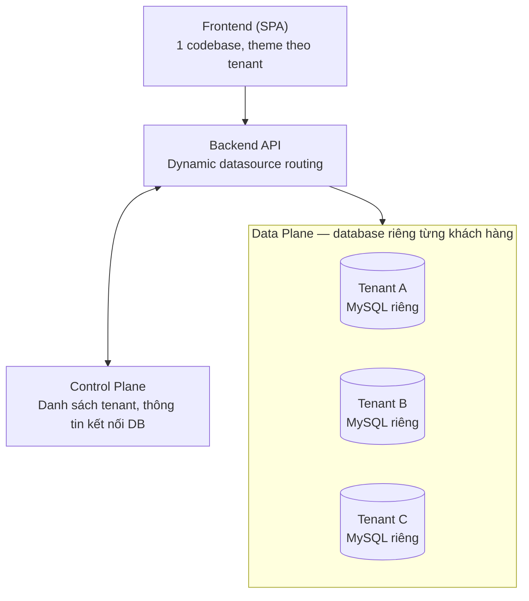
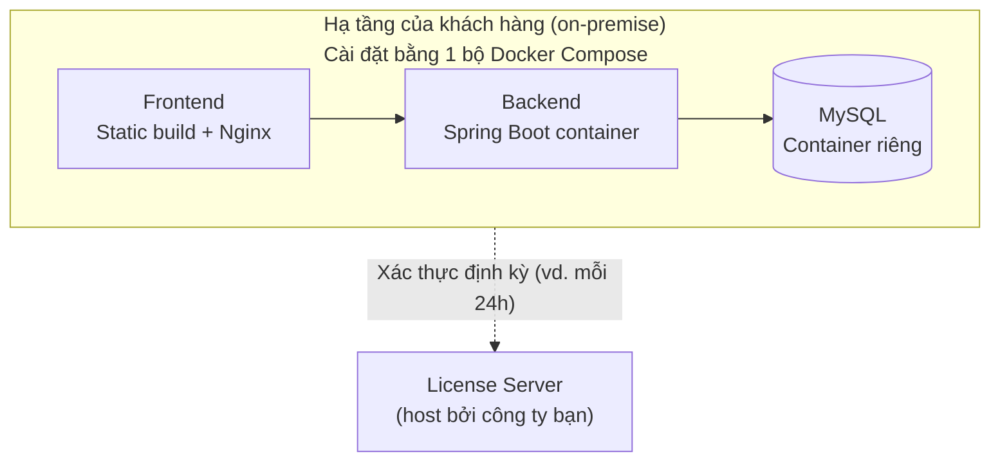

# KIẾN TRÚC TỔNG THỂ — HỆ THỐNG QUẢN LÝ KHO (SAAS ĐA KHÁCH HÀNG)

## 1. Bối cảnh

Công ty tự host phần backend cho tất cả khách hàng. Vấn đề đặt ra là tổ chức database và frontend như thế nào để:

- Dữ liệu của từng khách hàng (giá nhập, nhà cung cấp, công nợ...) được cách ly an toàn.
- Vận hành, cập nhật version, backup được tập trung, không phải làm thủ công cho từng khách hàng.
- Vẫn có khả năng bán gói **on-premise** riêng cho khách hàng cần tự quản lý hạ tầng.

Kết luận: nên bỏ phương án "kết nối vào database có sẵn của khách hàng" (rủi ro bảo mật, khó đồng bộ schema), và đi theo mô hình **SaaS multi-tenant với database riêng cho từng khách hàng**, có thêm lựa chọn đóng gói on-premise cho khách hàng đặc thù.

---

## 2. Kiến trúc SaaS đa khách hàng (mô hình chính)

### 2.1 Control Plane — "bộ não quản trị"

Tách biệt hoàn toàn khỏi dữ liệu nghiệp vụ của khách hàng. Nhiệm vụ:

- Lưu danh sách công ty đã mua app (khách hàng thuê app, khác với khách hàng mua hàng trong nghiệp vụ kho), gói dịch vụ, trạng thái tài khoản (active / suspended / trial hết hạn).
- Lưu thông tin kết nối database riêng của từng tenant — **bắt buộc mã hoá** (Vault, AWS Secrets Manager, hoặc mã hoá tầng ứng dụng), vì đây là "chìa khoá" vào dữ liệu của mọi khách hàng.
- **Tự động provisioning**: khi có khách hàng mới, tự động tạo database mới, chạy migration khởi tạo schema (theo đúng cấu trúc trong Database_Design.docx: Users, Product_Groups, Products, Customers, Transaction_Types, VAT_Options, Payment_Statuses, Inventory + các view), nạp dữ liệu mặc định.

### 2.2 Backend API

- Nhận request từ frontend, xác định request thuộc tenant nào (qua subdomain hoặc token đăng nhập chứa `tenant_id`).
- Tra cứu Control Plane (có cache để tránh hỏi lại mỗi request) để lấy thông tin kết nối DB tương ứng.
- Dùng cơ chế **dynamic routing datasource** (Spring: `AbstractRoutingDataSource`) để mọi câu lệnh SQL của request chạy đúng vào database của tenant đó.

### 2.3 Data Plane

- Mỗi khách hàng có **1 database MySQL riêng biệt** (Database-per-tenant), có thể chung 1 server MySQL (khác tên database) hoặc tách server theo quy mô gói dịch vụ.
- Lý do chọn cách ly vật lý thay vì 1 DB dùng chung + cột `tenant_id`: dữ liệu trong hệ thống này khá nhạy cảm (giá nhập, nhà cung cấp, công nợ khách hàng), nên đánh đổi vận hành phức tạp hơn để đổi lấy an toàn — một bug ở tầng ứng dụng khó làm lộ dữ liệu chéo giữa các khách hàng.
- Đánh đổi: khi cập nhật schema (thêm cột, thêm bảng ở Phase 2) phải chạy migration hàng loạt qua từng DB — cần công cụ như Flyway/Liquibase để tự động hoá.

### 2.4 Frontend

- **Chỉ 1 bản build duy nhất**, không build riêng từng khách hàng.
- Mỗi khách hàng truy cập qua subdomain riêng, ví dụ `khachhangA.tenapp.com`.
- Khi load, frontend đọc subdomain → gọi Control Plane lấy cấu hình hiển thị riêng (logo, theme màu — đúng yêu cầu mục 4.6 trong SRS: "hỗ trợ template màu khác nhau cho doanh nghiệp") → gắn `tenant_id` vào mọi request gửi lên Backend.
- Đây gọi là **white-labeling**: khách hàng cảm giác như "app riêng của họ" nhưng thực chất chạy chung 1 codebase, dễ bảo trì và phát hành version đồng loạt.

---

## 3. Đóng gói on-premise (gói bán riêng cho khách hàng lớn)

**Định nghĩa:** on-premise là cách bán phần mềm mà thay vì công ty host backend + database trên server của mình (mô hình SaaS), toàn bộ hệ thống — frontend, backend và database — được đóng gói thành **một bộ cài đặt hoàn chỉnh**, giao cho khách hàng tự cài đặt và vận hành ngay trong hạ tầng (server, mạng nội bộ) của chính họ. Khách hàng "mang cả app về nhà", tự chạy, tự giữ dữ liệu — công ty không còn là nơi lưu trữ dữ liệu của họ nữa.

Dành cho khách hàng không muốn dữ liệu rời khỏi hạ tầng nội bộ (ngân hàng, cơ quan nhà nước, công ty có chính sách bảo mật riêng).

### 3.1 Cách đóng gói

- 1 container **Frontend**: build tĩnh, phục vụ qua Nginx.
- 1 container **Backend**: Spring Boot, đóng gói sẵn `.jar`.
- 1 container **MySQL**: có script khởi tạo schema tự động chạy lần đầu (`docker-entrypoint-initdb.d`).
- Gói chung trong 1 file `docker-compose.yml` — khách hàng chỉ cần chạy một lệnh `docker compose up -d` là toàn bộ hệ thống (giao diện, xử lý nghiệp vụ, database) lên và chạy ngay trên máy chủ của họ, không phụ thuộc kết nối tới server công ty để hoạt động hằng ngày.
- Với khách hàng quy mô lớn hơn, có thể chuyển sang Kubernetes/Helm chart thay vì Compose.

### 3.2 Cơ chế bản quyền (License)

Vì công ty không kiểm soát được server khách hàng, cần 1 **License Server** riêng (do công ty host) để backend on-premise định kỳ gọi về xác thực license còn hạn hay không. Nếu license hết hạn: chuyển hệ thống sang chế độ read-only hoặc khoá bớt tính năng — **không xoá dữ liệu** của khách hàng.

### 3.3 So sánh SaaS vs On-premise

| Khía cạnh | SaaS (đa khách hàng) | On-premise (đóng gói) |
| --- | --- | --- |
| Nơi lưu dữ liệu | Server công ty | Server khách hàng |
| Cập nhật phần mềm | Công ty chủ động deploy | Khách hàng tự `docker compose pull && up`, hoặc cần cơ chế auto-update |
| Backup | Công ty kiểm soát, tự động | Khách hàng tự backup — cần script/hướng dẫn kèm theo |
| Bảo trì / debug | Công ty có toàn quyền truy cập | Gần như không truy cập được từ xa |
| Mô hình doanh thu | Thuê bao định kỳ (subscription), dễ triển khai | Thường bán license 1 lần + phí bảo trì năm, khó ép gia hạn |

### 3.4 Khuyến nghị vận hành

Duy trì đồng thời 2 mô hình sẽ tốn công gấp đôi cho việc phát hành version, vá lỗi, hỗ trợ kỹ thuật. Với quy mô vừa và nhỏ, nên:

- **SaaS là sản phẩm chính**, bán đại trà theo subscription.
- **On-premise là gói "Enterprise"** giá cao, có hợp đồng riêng, chỉ triển khai khi khách hàng thực sự yêu cầu và trả đủ chi phí cho việc đó — không coi là lựa chọn ngang hàng với SaaS ngay từ đầu.

---

## 4. Tóm tắt quyết định kiến trúc

1. Bỏ phương án "kết nối vào DB có sẵn của khách hàng".
2. Dùng **Database-per-tenant**: mỗi khách hàng 1 database MySQL riêng, cùng schema chuẩn.
3. Xây **Control Plane** riêng: quản lý danh sách tenant, thông tin kết nối DB (mã hoá), tự động provisioning.
4. Backend dùng **dynamic datasource routing** để định tuyến đúng DB theo từng request.
5. **1 frontend duy nhất**, tuỳ biến theo tenant qua subdomain (white-labeling), không build riêng từng khách hàng.
6. **On-premise** là gói bán riêng (Enterprise), đóng gói bằng Docker Compose, có License Server xác thực định kỳ.
